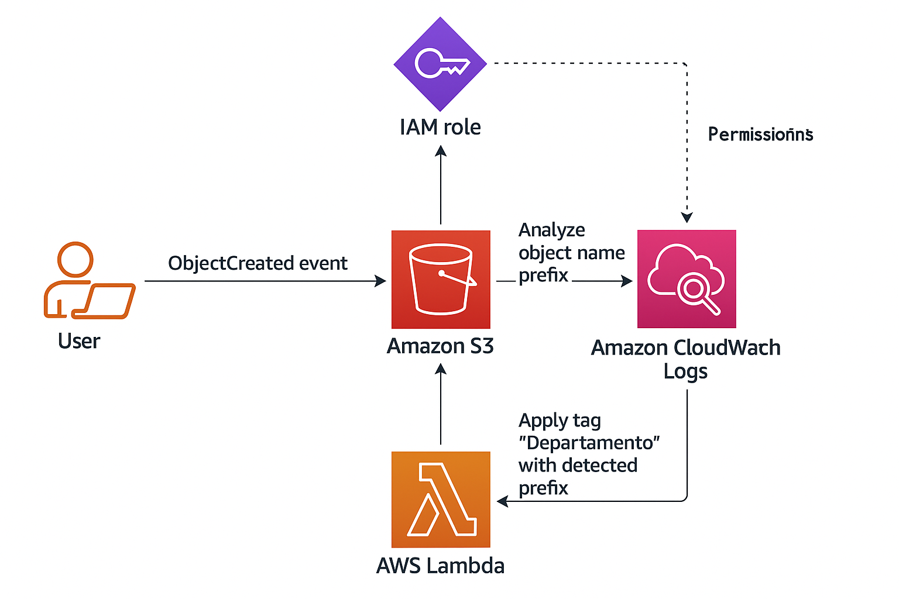

# 🏷️ Automação de Tag em Objetos S3 com AWS Lambda

Este projeto demonstra uma arquitetura serverless que aplica automaticamente uma **tag de departamento** aos objetos enviados para um bucket do Amazon S3, com base no **prefixo do nome do objeto**. Ideal para cenários em que você precisa organizar, classificar ou gerar relatórios por área da empresa (ex: Financeiro, Engenharia, RH, etc).

---

## 📌 Visão Geral da Arquitetura

1. Um **usuário** envia um arquivo para um bucket S3.
2. O bucket possui uma notificação configurada para eventos do tipo `s3:ObjectCreated:*`.
3. O evento aciona uma **função AWS Lambda**.
4. A função analisa o **prefixo do caminho do objeto**.
5. Com base no prefixo, a função aplica uma **tag no próprio objeto**, chamada `Departamento`.
6. Logs da execução são enviados para o **Amazon CloudWatch Logs**.
7. Uma **IAM Role** garante permissões seguras e mínimas para a Lambda acessar o S3 e gerar logs.

---

## 🧠 Exemplo Prático

- Objeto: `financeiro/relatorio-agosto.pdf`  
  → Tag aplicada: `Departamento=financeiro`

- Objeto: `engenharia/projeto-x.xlsx`  
  → Tag aplicada: `Departamento=engenharia`

---

## 🔐 Permissões da IAM Role

A função Lambda utiliza uma role com as seguintes permissões mínimas:

```json
{
  "Effect": "Allow",
  "Action": [
    "s3:PutObjectTagging",
    "logs:CreateLogGroup",
    "logs:CreateLogStream",
    "logs:PutLogEvents"
  ],
  "Resource": "*"
}
```  
<!-- ⬅️ Fecha o bloco de código JSON aqui -->

> ⚠️ **Obs:** Em produção, você deve restringir os ARNs para maior segurança.

## 📷 Diagrama da Arquitetura


